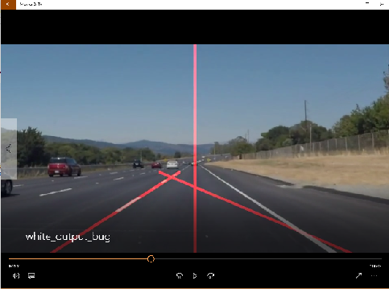

#**Udacity Self-Driving Car Engineer Nanodegree: Project #1 Finding Lane Lines on the Road**

---

**Finding Lane Lines on the Road**

The goals / steps of this project are the following:
* Make a pipeline that finds lane lines on the road
* Reflect on your work in a written report

---

### Reflection

####1. Describe your pipeline. As part of the description, explain how you modified the draw_lines() function.

The current implementation of the pipeline involves the following steps:
1. Copy the input image
2. Turn the copied image into grayscale and apply Gaussian blur
3. Using the Canny algorithm to retrieve the image with only the edges
4. Calculate the region of interest
5. Apply the region of interest mask on the edges image
6. Retrieve line segments with the Hough transform
7. Draw the lines
8. Apply the lines over the copied image
9. Save images in a separate folder called "processed_images"

During development, I come to realize that using a triangle-shaped region of interest was causing uneveness between the 
left and right side lane lines. It was at this point that I decided to use a trapezoid as the region of interest. By doing this
I was able to keep the length of both the left and right lane lines to be around the same length. 

The next step was to allow the pipeline to be used in video formats. This was pretty simple as the code provided in the 
jupyter notebook was simply calling a method for each frame in the video. I wrote a separate class for the video processor
and modified the following line to include the method from the base LaneLinesMarker class.

```python
import LaneLinesMarker as marker
video_clip = clip1.fl_image(marker.process_image) 
```

For the task to extrapolate the lane lines to be solid, I used a suggestion I saw in the discussion forum for this course
in the Udacity forums. The algorithm involved the following:

1. Split the image in half and assign line segments into either the left or right side. 
2. Use the numpy polyfit() function to calculate a polynomial formula that fits the points in the left and right array.
3. Using the formula, calculate the corresponding x-coordinates for two points: the bottom of the image (height of the image)
and the height of the region of interest trapezoid from the bottom of the image. In order to extract the x value, I used
x = (y-b)/m
4. Draw a line between the two points.

This particular task in the project allowed me to gain some insight and fine tune the variables going into the OpenCV function
calls. An example of this can be seen in Figure 1. In the initial output for "solidWhiteRight.mp4", I noticed that on a couple 
of frames, the right side lane line would cross across the middle of the image. I hypothesized that this was caused by
the Hough transform attributes picking up line segments that was not needed. I was able to confirm this hypothesis by adjusting
the threshold, min_line and max_line parameters.



####2. Identify potential shortcomings with your current pipeline

The main shortcoming with the current implementation is that it does not support the challenge video. After taking
a look at the output of the video, I've come to realize that the hood of the car being on display is throwing a lot
of the logic in the pipleline off. Because simple adjustment of variables in the OpenCV methods was not going to 
solve this problem without affecting the other videos, I decided to skip the opportunity for the time being. 

####3. Suggest possible improvements to your pipeline

Here are some potential improvements that can be pursued in the future:
1. Add support for challenge videos / videos with foreign objects in the video (such as the hood of the car)
2. Test with videos of different resolution
3. Implement better method splitting the left and right lane lines. On very sharp turns, the lane lines could potentially
cross the center line.